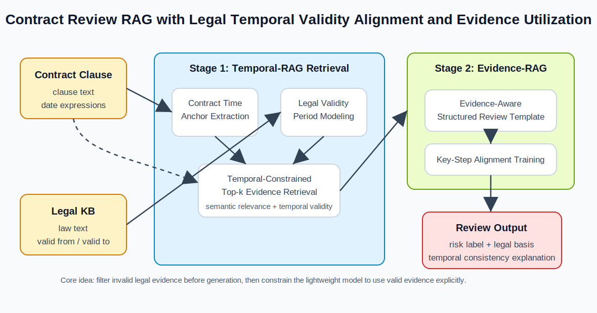

# Temporal-Evidence-RAG

基于法律时效对齐与证据利用的合同审查 RAG 框架。

- `Temporal-RAG`: 按合同时间锚点过滤法律依据，减少失效法条或版本错配进入上下文。
- `Evidence-RAG`: 基于时间对齐证据生成结构化合同风险审查结果。

## Framework



## Setup

Pip:

```bash
conda create -n paper_rag python=3.10 -y
conda activate paper_rag
python -m pip install -r requirements.txt
cp .env.example .env
```

Conda:

```bash
conda env create -f environment.yml
conda activate paper_rag
cp .env.example .env
```

## Data

```bash
python scripts/download_datasets.py \
  --repo-id p1553965822/paper-aligned-contract-rag-datasets \
  --local-dir data
```

No released dataset yet:

```bash
python scripts/build_datasets.py --force
```

## Models

Set local model paths in `.env`, or download public baselines:

```bash
python scripts/download_models.py --models minicpm roberta qwen3
```

## Run

Smoke test:

```bash
python scripts/check_model_connections.py
python scripts/smoke_test_minicpm.py
```

Contract risk review:

```bash
python scripts/run_minicpm_rag_evaluation.py \
  --dataset GrassRisk \
  --train-dataset GrassRisk \
  --tune-dataset GrassRisk \
  --split test \
  --decision-mode hybrid \
  --label-style numeric \
  --calibration-objective f1 \
  --methods "MiniCPM-2.4B Direct" "Standard-RAG + Direct Generation" "Temporal-RAG + Direct Generation" "Standard-RAG + Evidence-RAG" "Temporal-RAG + Full-Distill" "Temporal-RAG + Evidence-RAG" "MiniCPM-SFT"
```

Component experiments:

```bash
python scripts/run_component_experiments.py --mode all --evidence-dataset GrassRisk
```

MiniCPM-SFT training:

```bash
python scripts/train_minicpm_sft.py \
  --dataset GrassRisk \
  --output-dir models/minicpm_sft_lora_grassrisk \
  --epochs 1 \
  --gradient-accumulation-steps 8 \
  --max-length 384 \
  --lora-r 8 \
  --lora-alpha 16 \
  --batch-size 1
```
