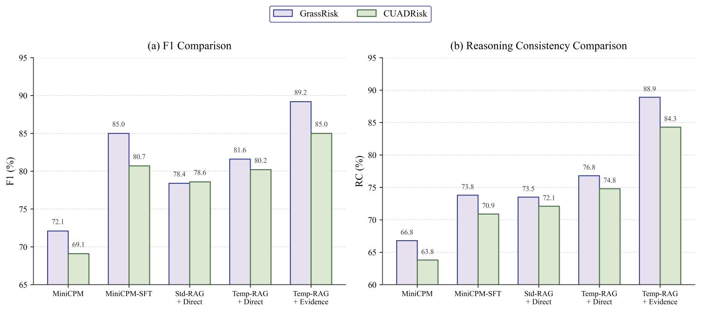
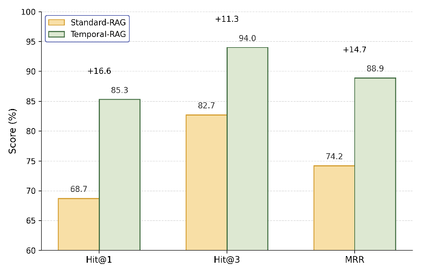
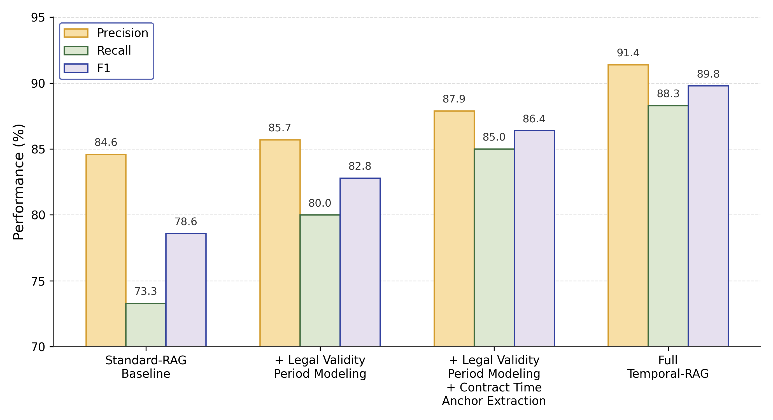

# 基于法律时效对齐与证据利用的合同审查 RAG 框架

本项目实现论文《基于法律时效对齐与证据利用的合同审查RAG框架》中的核心实验代码。仓库只保留可公开的源代码、配置、脚本和说明文件，不包含数据集、模型权重、私有合同、运行输出或本地密钥。

论文面向合同风险审查中的两个常见问题：标准 RAG 容易召回已经失效、尚未生效或版本错位的法律依据；轻量模型在低资源场景下又容易出现证据引用不足、风险判断与审查理由不一致。项目因此采用两阶段设计：

- `Temporal-RAG`：建模法律效力周期，抽取合同时间锚点，并在检索阶段过滤时间不适用的法律依据。
- `Evidence-RAG`：将合同条款、时间锚点和时间对齐证据组织为结构化审查输入，通过关键步骤对齐训练提升轻量模型的证据利用能力。

## 总体框架


## 论文实验素材







论文中的主要结果包括：

- 在 GLTRD 法律时效对齐任务上，Temporal-RAG 相比 Standard-RAG 将 F1 从 `73.8%` 提升到 `84.7%`。
- 在 GrassRisk 合同风险审查任务上，Temporal-RAG + Evidence-RAG 达到 `89.2%` F1 和 `88.9%` RC。
- 在 CUADRisk 一般合同风险审查任务上，Temporal-RAG + Evidence-RAG 达到 `85.0%` F1 和 `84.3%` RC。
- Temporal-RAG 的 Hit@1、Hit@3 和 MRR 分别达到 `85.3%`、`94.0%` 和 `0.889`。

## 仓库内容

```text
src/paper_rag/          Core library code
scripts/                Dataset, training, evaluation, and utility scripts
configs/                Experiment and model configuration
docs/                   Experiment notes and README assets
data/                   Placeholder only; real datasets are downloaded separately
models/                 Placeholder only; model weights are downloaded separately
outputs/                Placeholder only; local run outputs are ignored
```

## 不包含的内容

以下内容不会提交到 GitHub：

- `data/processed/**` 和 `data/raw/**` 中的实际样本与法律知识库文件
- `models/**` 中的模型权重、LoRA adapter、合并模型或 checkpoint
- `outputs/**` 中的实验输出、日志和临时文件
- `.env`、API key、本机路径、私有合同和人工上传材料

## 环境安装

推荐 Python `3.10`。

```bash
conda create -n paper_rag python=3.10 -y
conda activate paper_rag
python -m pip install -r requirements.txt
python -m pip install -r requirements-models.txt
```

复制环境变量模板：

```bash
cp .env.example .env
```

Windows PowerShell 可使用：

```powershell
copy .env.example .env
```

## 数据集

数据集应单独放在 Hugging Face Dataset 仓库，不进入 GitHub。默认数据集仓库名建议为：

```text
p1553965822/paper-aligned-contract-rag-datasets
```

如果 Hugging Face 实际用户名不是 `p1553965822`，请把命令中的 repo id 替换成你的真实 namespace。

下载数据：

```bash
python scripts/download_datasets.py \
  --repo-id p1553965822/paper-aligned-contract-rag-datasets \
  --local-dir data
```

下载后目录应类似：

```text
data/raw/legal_validity_kb.jsonl
data/raw/laws/legal_validity_kb.jsonl
data/processed/GLTRD/{train,val,test,all}.jsonl
data/processed/GrassRisk/{train,val,test,all}.jsonl
data/processed/CUADRisk/{train,val,test,all}.jsonl
```

如果只想生成一份可跑通的合成数据，可执行：

```bash
python scripts/build_datasets.py --force
```

## 模型权重

模型权重不随 GitHub 仓库发布。请下载到 `models/` 或在 `.env` 中填写你自己的路径：

```text
MINICPM_2_4B_MODEL_PATH=models/minicpm_2_4b
MINICPM_SFT_ADAPTER_PATH=models/minicpm_sft_lora
QWEN3_8B_MODEL_PATH=models/qwen3_8b
INTERNLM_LAW_7B_MODEL_PATH=models/internlm2_law_7b
ROBERTA_MODEL_PATH=models/chinese_roberta_wwm_ext
EXPERT_13B_MODEL_PATH=
```

可用脚本下载公开基座模型：

```bash
python scripts/download_models.py --models minicpm roberta qwen3
```

`MiniCPM-SFT` 是本项目训练得到的 LoRA/SFT adapter，需要自行训练或替换为你自己的 adapter。

## 快速跑通

1. 安装依赖。
2. 下载数据集到 `data/`，或执行 `python scripts/build_datasets.py --force` 生成合成数据。
3. 下载模型权重或在 `.env` 中设置模型路径。
4. 运行 smoke test 或实验脚本。

```bash
python scripts/check_model_connections.py
python scripts/smoke_test_minicpm.py
```

整体合同风险审查：

```bash
python scripts/run_minicpm_rag_evaluation.py \
  --dataset GrassRisk \
  --train-dataset GrassRisk \
  --tune-dataset GrassRisk \
  --split test \
  --decision-mode hybrid \
  --label-style numeric \
  --calibration-objective f1 \
  --methods "MiniCPM-2.4B Direct" "Standard-RAG + Direct Generation" "Temporal-RAG + Direct Generation" "Standard-RAG + Evidence-RAG" "Temporal-RAG + Full-Distill" "Temporal-RAG + Evidence-RAG" "MiniCPM-SFT"
```

组件实验：

```bash
python scripts/run_component_experiments.py \
  --mode all \
  --evidence-dataset GrassRisk
```

效率测试：

```bash
python scripts/run_efficiency_benchmark.py \
  --dataset GrassRisk \
  --split test \
  --limit 32 \
  --methods "Expert-only" "MiniCPM-SFT" "Temporal-RAG + Evidence-RAG"
```

## 上传数据集到 Hugging Face

安装并登录 Hugging Face 后执行：

```bash
hf auth login
hf repos create p1553965822/paper-aligned-contract-rag-datasets --type dataset --private
python scripts/upload_datasets_to_hf.py \
  --repo-id p1553965822/paper-aligned-contract-rag-datasets \
  --source-dir data
```

如需公开数据集，将 Hugging Face Dataset 仓库设置为 public；如数据包含受限或私有合同，请保持 private。

## 训练 MiniCPM-SFT

```bash
python scripts/train_minicpm_sft.py \
  --dataset GrassRisk \
  --output-dir models/minicpm_sft_lora_grassrisk \
  --epochs 1 \
  --gradient-accumulation-steps 8 \
  --max-length 384 \
  --lora-r 8 \
  --lora-alpha 16 \
  --batch-size 1
```

训练产物在 `models/` 下，默认不会被 git 跟踪。

## 复现实验映射

| 论文实验 | 代码入口 |
|---|---|
| 数据集统计 | `scripts/run_paper_experiment.py --mode measured` |
| GrassRisk 整体风险审查 | `scripts/run_minicpm_rag_evaluation.py --dataset GrassRisk` |
| CUADRisk 整体风险审查 | `scripts/run_minicpm_rag_evaluation.py --dataset CUADRisk` |
| 法律时效对齐 | `scripts/run_component_experiments.py --mode gltrd` |
| 合同时间锚点抽取 | `scripts/run_component_experiments.py --mode gltrd` |
| 检索证据命中 | `scripts/run_component_experiments.py --mode gltrd` |
| 低资源证据利用 | `scripts/run_component_experiments.py --mode evidence` |
| 效率与部署成本 | `scripts/run_efficiency_benchmark.py` |

## 开源发布规则

- 不把论文目标值硬编码成实验结果。
- 不把旧结果表复制成新运行结果。
- 不提交数据集、模型权重、私有合同、`.env`、API key 或运行日志。
- 模型路径缺失、权重无法加载或显存不足时，对应方法应从结果中省略。
- 出现异常高指标时，应检查数据泄漏、近重复样本和阈值设置后再复跑。
